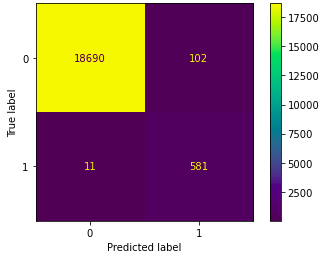
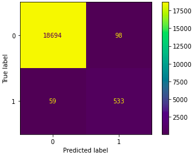

# Supervised-Machine-Learning Challenge - Credit Risk Evaluator

Module 19 Challenge - Supervised Machine Learning comparing the Logistic Regression model and Random Forest Classifier

## Background

Lending services companies allow individual investors to partially fund personal loans as well as buy and sell notes backing the loans on a secondary market.

In this challenge, we will be using this data to create machine learning models to classify the risk level of given loans based on the `loan_status`. Specifically, we will be comparing the **Logistic Regression Model** and **Random Forest Classifier**.

## Process Steps

This Challenge considers the following main process steps:
1) Retrieve the Data
2) Identify X and y for the Model prediction
3) Split the Data into Training and Testing Sets
4) Preprocess the Data

Once the data is identified, split and scaled, we can proceed with the training and evaluating the performance of each model (**Logistic Regression Model** and **Random Forest Classifier**):
* Instantiate the model
* Train the model
* Make the prediction
* Evaluate the performance of the model

### Logistic Regression Model
* **Training Score:**  0.9941188609162196
* **Testing Score:**  0.9941704498555509

- Confusion Matrix:

### Random Forest Classifier

* **Training Score:**  0.9971798046498831
* **Testing Score:**  0.991900536524969

- Confusion Matrix:

## References

Loan Approval Dataset (2022). DData for this dataset was generated by edX Boot Camps LLC, and is intended for educational purposes only.